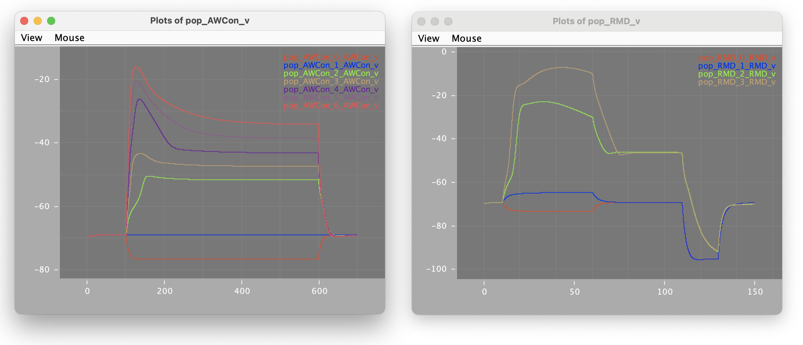

## Nicoletti et al. 2019 _C. elegans_ neuron models 

These are the model scripts for the [Nicoletti et al. 2019: Biophysical modeling of _C. elegans_ neurons: Single ion currents and whole-cell dynamics of AWCon and RMD](https://journals.plos.org/plosone/article?id=10.1371/journal.pone.0218738).

### Original XPP scripts

The XPP files for the 2 cells are:

- [RMD.ode](RMD.ode)
- [AWC.ode](AWC.ode)

### NeuroML conversion of the cells

[NeuroML](http://www.neuroml.org) compliant versions of the cells and all the ion channels can be found in [this folder](NeuroML2):

- [RMD.cell.nml](NeuroML2/RMD.cell.nml)
- [AWCon.cell.nml](NeuroML2/AWC.cell.nml)

These cell models can be run with [pyNeuroML](https://docs.neuroml.org/Userdocs/Software/pyNeuroML.html):
```
    pynml LEMS_Sim_Fig4C_AWCon.xml

    pynml Fig7B_RMD.net.nml
```
and will produce the following:



These cells have been tested against the original XPP versions, see [regenerateAndTest.sh](NeuroML2/regenerateAndTest.sh).
